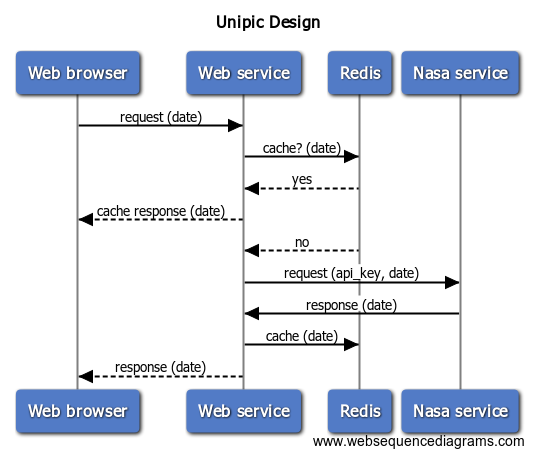

# Unipic - Astronomy picture of the Day
Simple Golang application that shows astronomy picture with explanation.

# Implementation
Unipic displays astronomy picture of the provided date from https://api.nana.gov  
`GET https://api.nasa.gov/planetary/apod`

## Architectural design


# How to use

## Prerequisites

### Environment variable
| Environment variable | Description            |
|:---------------------|:-----------------------|
| NASA_API_KEY         | Nasa api key           |

(Note: `NASA_API_KEY` is included in `docker-compose.yaml` for ease of testing. `NASA_API_KEY` has to be in `.env` file which has not to be commited)

### Golang, Docker, Docker-compose
https://golang.org/doc/install  
https://docs.docker.com/install  
https://docs.docker.com/compose/install

## How to run
```sh
go get github.com/sysdevguru/unipic
cd $GOPATH/src/github.com/sysdevguru/unipic
docker-compose up --remove-orphans
```

unipic listens on `localhost:8080`